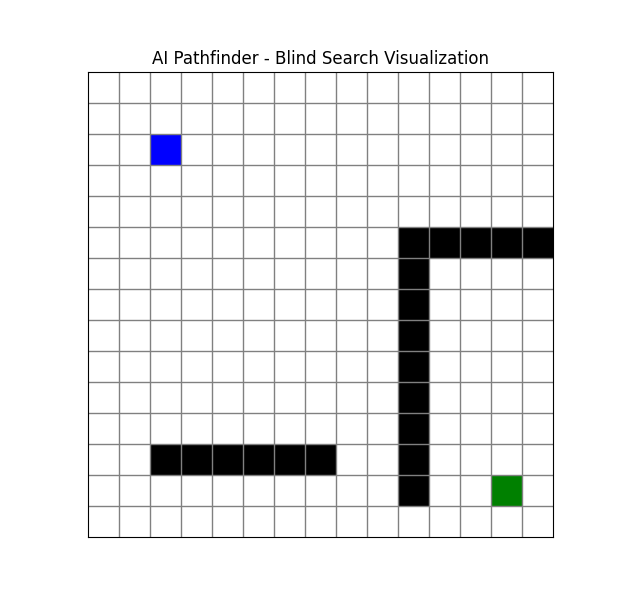
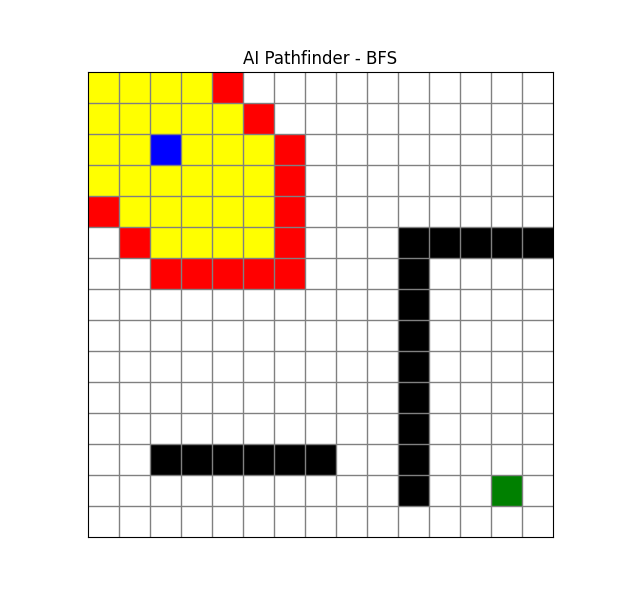
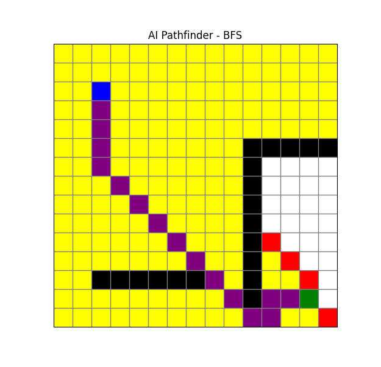
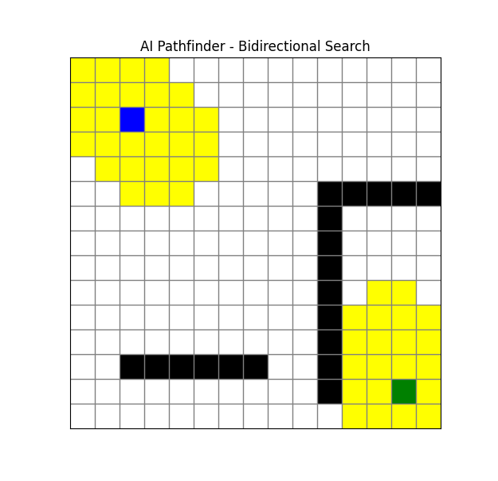
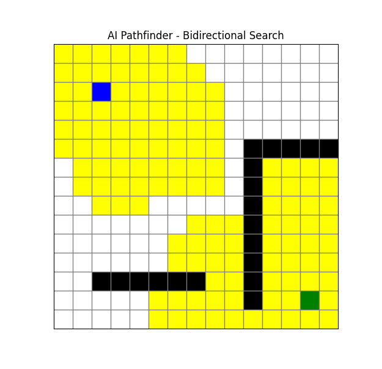
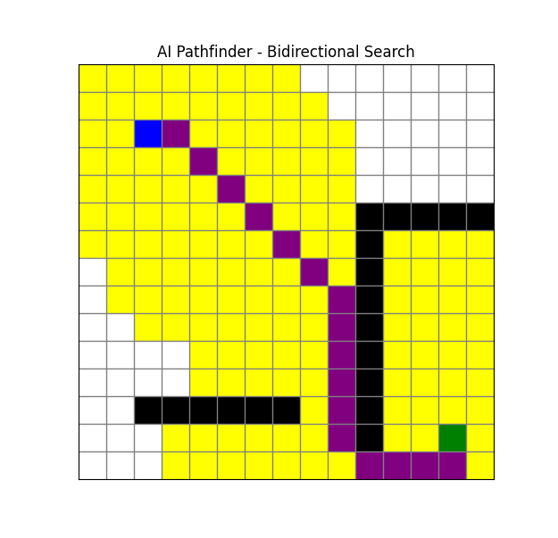
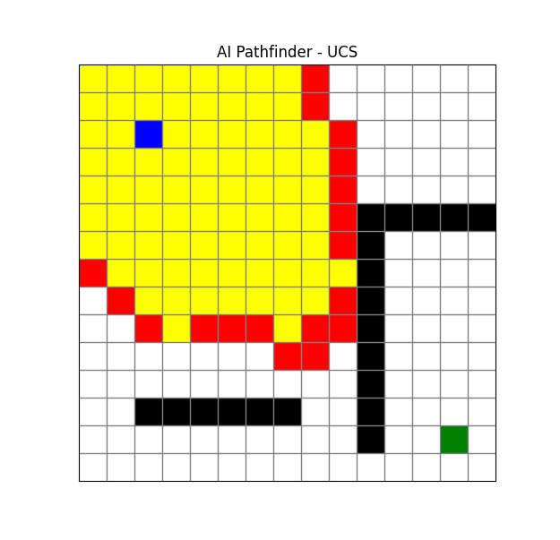
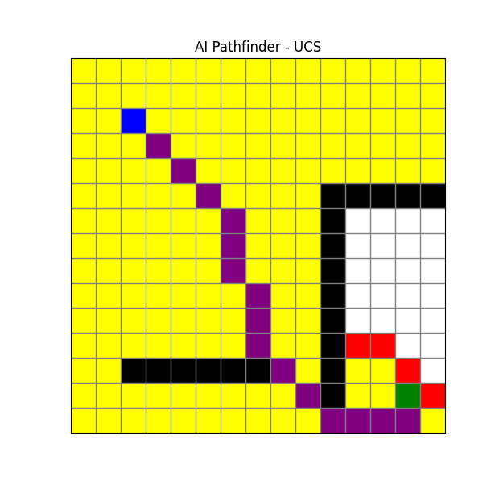
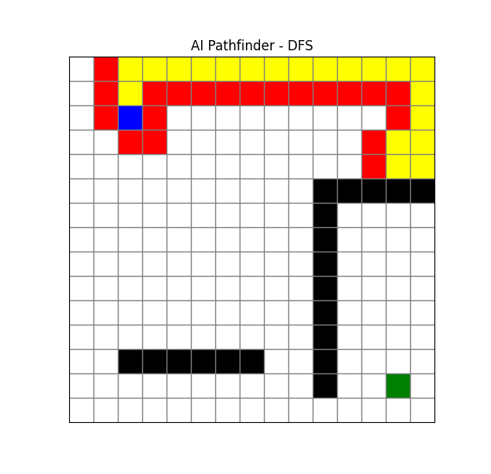
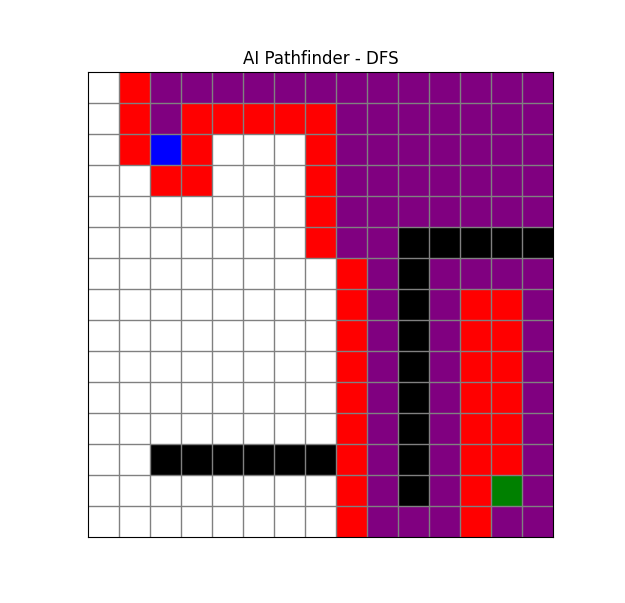

# AI Pathfinder – Blind Search Visualization

This project provides a **visual demonstration of classical blind (uninformed) search algorithms** used in Artificial Intelligence.  
It shows how different algorithms explore a grid-based environment to find a path from a **Start node (S)** to a **Target node (T)** while avoiding static obstacles (walls).

The goal is to help learners **intuitively understand search behavior, exploration patterns, and performance differences** among blind search strategies.

---

## 🔍 Implemented Algorithms

The following six fundamental blind search algorithms are implemented and visualized:

1. **Breadth-First Search (BFS)**  
2. **Depth-First Search (DFS)**  
3. **Depth-Limited Search (DLS)**  
4. **Iterative Deepening Depth-First Search (IDDFS)**  
5. **Uniform Cost Search (UCS)**  
6. **Bidirectional Search**

Each algorithm explores the same grid environment using a consistent movement policy to ensure fair comparison.

---

##  Strict Movement Order

All algorithms expand neighboring nodes using a **fixed clockwise order** (including only the main diagonal directions):

1. **Up**  
2. **Right**  
3. **Down**  
4. **Down-Right (Diagonal)**  
5. **Left**  
6. **Up-Left (Diagonal)**  

> **Note:**  
> The **Top-Right** and **Bottom-Left** diagonal moves are intentionally excluded to maintain deterministic and controlled behavior across all searches.

---

## ⚙️ Setup & Execution

### 1️⃣ Install Required Dependency
```bash
pip install matplotlib
```

### 2️⃣ Run the Application
```bash
python main.py
```
You will be prompted to select a scenario and a search algorithm.  
The visualization will then animate how the chosen algorithm explores the grid.

---

##  Project Gallery
Below are sample visualizations showing the search algorithms in action.

###  Color Legend
*   🔵 **Blue** — Start Node
*   🟢 **Green** — Target Node
*   🟡 **Yellow** — Explored Nodes
*   🔴 **Red** — Frontier (Open List)
*   🟣 **Purple** — Final Path

### 📌 Visualization Examples


*Figure 1: 15 x 15 Grid with Start and Target nodes*


*Figure 2: BFS algorithm execution START*


*Figure 3: BFS algorithm execution STOP*


*Figure 4: Bi-Directional Algorithm START*


*Figure 5: Bi-Directional Algorithm RUNNING*


*Figure 6: Bi-Directional Algorithm STOPS*


*Figure 7: UCS RUNNING*


*Figure 8: UCS STOPS*


*Figure 9: DFS RUNNING*


*Figure 10: DFS STOPS*
